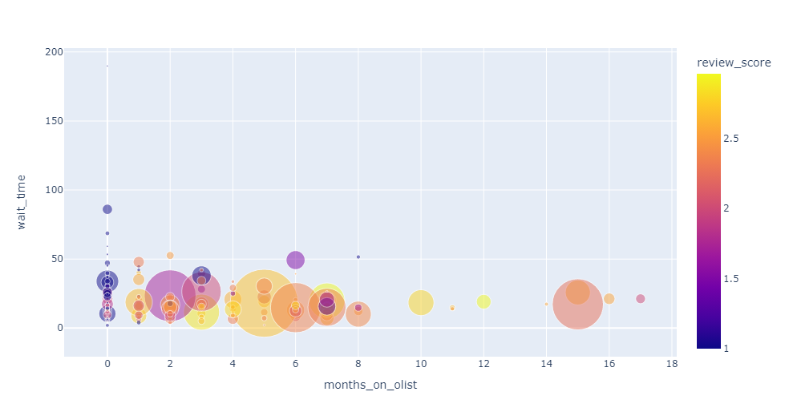

# E-commerce Service Analysis

<h3 align="center">Goal: Analyse the sellers on the e-commerce service Olist, and identify how to increase customer satisfaction whilst maintaing a healthy order volume.</h3>

- 🏳️ Dataset: [https://www.kaggle.com/datasets/olistbr/brazilian-ecommerce](https://www.kaggle.com/datasets/olistbr/brazilian-ecommerce)

Languages and Tools used:
* Python
* NumPy
* Data Visualisation
* PlotlyExpress
* Importing classes
* Feature Analysis

## Findings

**Takeaway** - sellers who are at the early stages of being with Olist are contributing most to a high wait time and a low review score.

**Potential suggestion** would be instead of removing non-profitable sellers, one idea could be to review the onboarding and selection process.
